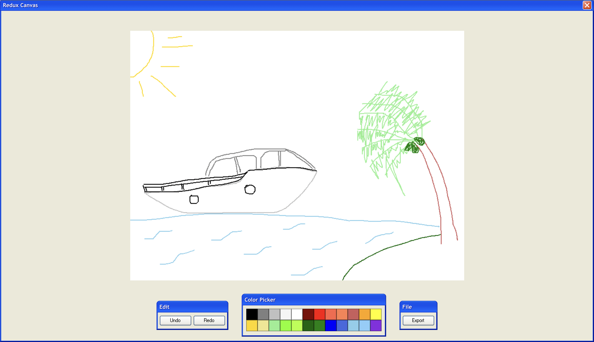

# Redux Canvas

## Live link
[Click here to draw on the canvas](https://redux-canvas.netlify.app/)
## Objectives
- Managing global state with Redux
- Creating slices with Redux ToolKit
- Design patterns with React TypeScript apps

## Features
> A drawing canvas with a color picker, editing and file saving options. Designed for screens larger than 1000px and above.

## Built With
- React
- Redux Toolkit
- TypeScript
- npm
- HTML5/CSS3
- XP.css

## Getting Started
- Clone this project by running `git clone git@github.com:george-swift/redux-canvas.git`
- Run `npm install` to install the required dependencies.
- After installing all dependencies, run `npm start` to fire up a local server with live reloading.
- If not already redirected, visit `http://localhost:3000/` in your browser to use _Redux canvas_
- To terminate the server, enter `Ctrl + C` in your terminal.
- To get a production bundle, run `npm run build`

## Authors

👤 &nbsp; **Ubong George**
- LinkedIn: [Ubong George](https://www.linkedin.com/in/ubong-itok)
- Twitter: [@\_\_pragmaticdev](https://twitter.com/__pragmaticdev)
- GitHub: [@george-swift](https://github.com/george-swift)

## Acknowledgments

- [TypeScript](https://www.typescriptlang.org/)
- [React](https://reactjs.org/)
- [Redux Toolkit](https://redux-toolkit.js.org/usage/usage-guide)
- [Fullstack React with TypeScript](https://newline.co/discord/)

## Show your support

Leave a :star:️ &nbsp; if you like this project!

## License

Available as open source under the terms of the [MIT License](https://opensource.org/licenses/MIT).